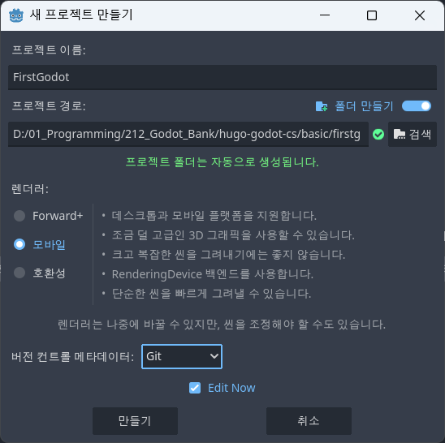
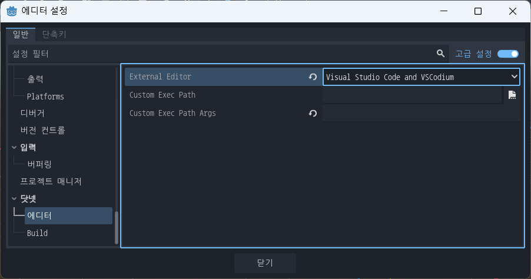
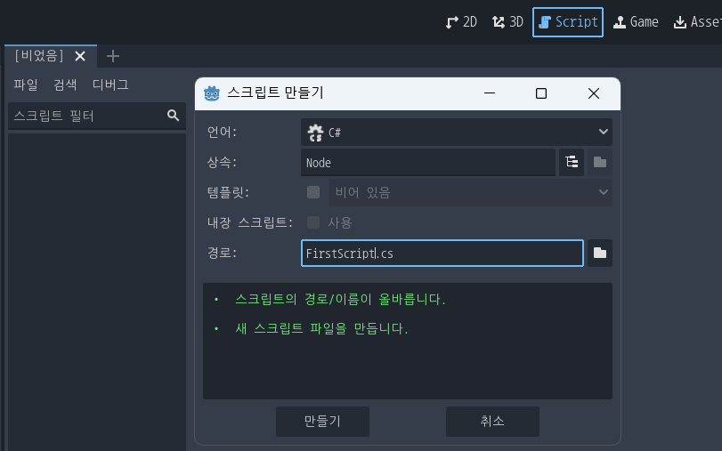
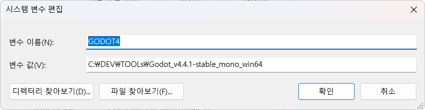
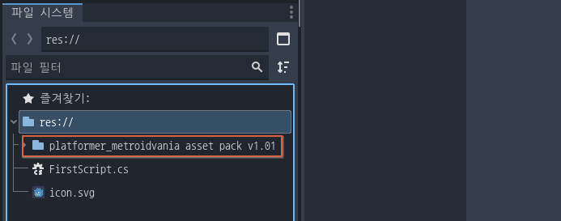

# hugo-godot-cs
Godot Engine C# 학습하기

## Godot C# 시작
- .NET 버전확인

    ```shell
    > dotnet --version
    9.0.203 
    ```

### Godot 설정
- 프로젝트 생성

    

- 에디터 설정
    - 메뉴 > 에디터 > 에디터 설정 

    


- 스크립트 생성
    - 자동으로 VS Code 오픈

    

- VSCode 실행

    


### Godot Game 팁
- 타일이미지 다운로드
    - Godot 툴로 드래그

    